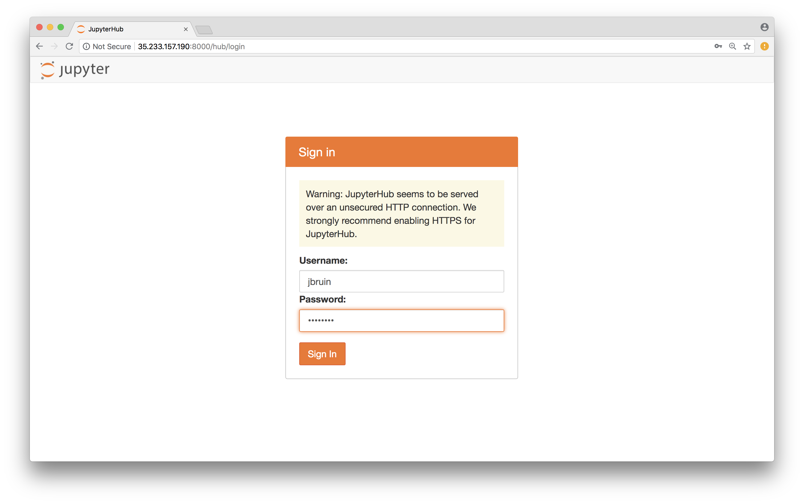

# Julia Meets Mendel: Algorithms and Software for Modern Genomic Data

This repo contains the materials for short course [_Julia Meets Mendel: Algorithms and Software for Modern Genomic Data_](http://ww2.amstat.org/meetings/jsm/2018/onlineprogram/ActivityDetails.cfm?SessionID=215388) at 2018 Joint Statistical Meeting (JSM), Vancouver, Canada.

## Instructors

* Janet Sinsheimer, Professor, Biomathematics, Biostatistics, Human Genetics, and Statistics, UCLA  

* Eric Sobel, Professor, Human Genetics, UCLA  

* Hua Zhou, Associate Professor, Biostatistics, UCLA  

## Syllabus

| Time | Topic | Instructor |  
|:-----------|:------------|:------------|  
| 8:30-9:00 | participants intro., OpenMendel | Eric Sobel |  
| 9:00-9:30 | Julia: intro. \[[ipynb](./lectures/02-juliaintro/juliaintro.ipynb)\], multiple dispatch/JIT/profiling \[[ipynb](./lectures/03-juliafun/juliafun.ipynb)\] | Hua Zhou |  
| 9:30-10:15 | Julia: linear algebra \[[ipynb](./lectures/04-julialinalg/numlinalg.ipynb)\], optimization \[[ipynb](./lectures/05-juliaopt/juliaopt.ipynb)\] | Hua Zhou |  
| 10:15-10:30 | coffee break | |  
| 10:30-11:15 | Julia: GPU \[[ipynb](./lectures/06-juliagpu/juliagpu.ipynb)\], NNMF \[[ipynb](./lectures/07-nnmf/nnmf.ipynb)\], parallel computing \[[ipynb](./lectures/08-juliaparallel/juliaparallel.ipynb)\] | Hua Zhou |  
| 11:15-noon | review of genetic and genomic concepts \[[pdf](./lectures/09-geneticsreview/reviewofGGconcepts07212018.pdf)\] | Janet Sinsheimer |  
| noon-1:00 | lunch | |  
| 1:00-1:30 | handling genetic data in OpenMendel \[[ipynb](./lectures/10-snparray/genedata.ipynb)\] | Hua Zhou |  
| 1:30-2:30 | GWAS for population and genetic analysis \[[pdf](./lectures/11-gwas/GWAS_Intro.pdf), [ipynb](./lectures/11-gwas/GWAS_Intro.ipynb)\] | Eric Sobel |  
| 2:30-3:15 | linear mixed models for genetic analysis \[[pdf](./lectures/12-lmm/linearmixedmodelJSM07302018.pdf), [ipynb](./lectures/12-lmm/LMM07302018JSM.ipynb)\] | Janet Sinsheimer |  
| 3:15-3:30 | coffee break | |  
| 3:30-4:30 | mendelian randomization \[[pdf](./lectures/13-mr/MendelRandom07302018JSM.pdf), [ipynb](./lectures/13-mr/MR_VCMnotebookWGCAC07102018.ipynb)\] | Janet Sinsheimer |  
| 4:30-5:00 | how to contribute to OpenMendel project | Eric Sobel |  

## Getting started

There are several ways to run Jupyter notebooks in this course.

### Run Jupyter notebooks on the dedicated server

The **easiest** way is to run Jupyter notebooks on a server dedicated to this course.  

1. Point your browser to [http://35.233.157.190:8000/](http://35.233.157.190:8000/).  

2. You'll be greeted by a JupyterHub login page:  

Your username is initial of your first name + your last name. For example, if your name is `Joe Bruin`, then your username is `jbruin`. Your password is `jsmce18c`. Of course you can change password after you log in, e.g., by `passwd` command at Bash terminal.

3. After login, you will see the JupyterLab interface:


4. To transfer the course materials to your home directory on the server, click `Terminal` in JupyterLab and type command
```bash
git clone https://github.com/Hua-Zhou/JSM2018-CE18C.git
```

You should see the folder `JSM2018-CE18C` in the `Files` tab on the left of JupyterLab. Now you can open any Jupyter notebooks in that folder and run the examples.

5. If you prefer the Jupyter Notebook interface instead of JupyterLab, change the address from `http://35.233.157.190:8000/user/jbruin/lab` to `http://35.233.157.190:8000/user/jbruin/tree`.  


### Run Jupyter notebooks on your own laptop

This is **not** recommended during this short course, since your software environment (OS, Julia version, package versions, etc.) may be quite different from that assumed by the Jupyter notebooks. In case you want to run Jupyter notebooks on your own machine, simply `git clone https://github.com/Hua-Zhou/JSM2018-CE18C.git` to sync the most recent course materials to your computer and install all needed Julia packages.
